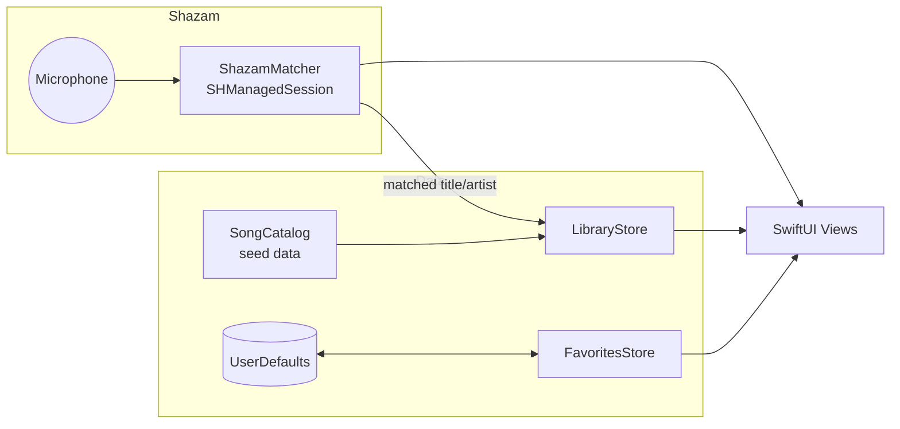

# ToneAmp — Architecture

## Overview

SwiftUI app targeting **iOS 17+**, no third-party dependencies. The architecture is deliberately small: observable stores + value-type models + views. Everything is first-party Apple (SwiftUI, Observation, ShazamKit, AVFoundation).



## Modules

| Module | Type | Responsibility |
| --- | --- | --- |
| `Models/Song.swift` | `struct`, `Codable` | `Song`, `Tone`, `AmpSettings`, `EffectPedal`, enums (`Genre`, `ToneCharacter`, `EffectType`) |
| `Models/SongCatalog.swift` | static data | Curated seed catalog (compiled in — see *Data strategy*) |
| `Stores/LibraryStore.swift` | `@Observable` | Catalog access, search/filter, fuzzy match for Shazam results |
| `Stores/FavoritesStore.swift` | `@Observable` | Favorite song IDs, `UserDefaults` persistence |
| `Shazam/ShazamMatcher.swift` | `@Observable`, `@MainActor` | Mic permission, `SHManagedSession` lifecycle, state machine for the Identify UI |
| `Views/…` | SwiftUI | Feature-grouped views (Library, Tone, Identify, Favorites, Shared) |

## State management

- **Observation framework** (`@Observable`), not `ObservableObject` — less boilerplate, more precise invalidation, the iOS 17-era default.
- Stores are created once in `ToneAmpApp` and injected with `.environment(_:)`; views read them with `@Environment(LibraryStore.self)`.
- Views own only transient UI state (`@State` for search text, filters, navigation paths).

## Data strategy

Seed data is a **compiled Swift catalog** (`SongCatalog.songs`) of `Codable` models rather than a bundled JSON file. Rationale:

- Zero runtime-parse failure modes for the MVP; the compiler validates every entry.
- The models are `Codable` on purpose: swapping in a bundled JSON, on-disk cache, or remote API later is a change to `LibraryStore` only — no view or model changes.

Stable string IDs (`"back-in-black"`) are used so favorites survive catalog updates and future server sync.

## ShazamKit integration

`ShazamMatcher` wraps **`SHManagedSession`** (iOS 17+), which manages the audio engine and buffers internally — no manual `AVAudioEngine` tap code.

State machine driving the Identify screen:

```
idle ──tap──▶ requestingPermission ──granted──▶ listening ──▶ matched(item)
                     │ denied                        │──▶ noMatch
                     ▼                               │──▶ failed(message)
                  denied            (tap while listening ──▶ cancel ──▶ idle)
```

- Mic permission is requested explicitly via `AVAudioApplication.requestRecordPermission()` so the denied path is a designed state, not a silent failure.
- On `.match`, the media item's title/artist are **normalized** (case/diacritic-folded, punctuation stripped) and fuzzy-matched against the catalog by `LibraryStore.match(title:artist:)` — exact normalized equality first, then containment, artist-verified when possible.
- The session is cancelled on cancel/disappear to release the microphone immediately.

## Persistence

`UserDefaults` for favorite IDs (a string array). Deliberately not SwiftData/Core Data — one small set does not justify a schema, migrations, or container setup. `FavoritesStore` is the single writer.

## Project format

The Xcode project uses **`objectVersion 77` + `PBXFileSystemSynchronizedRootGroup`** (Xcode 16 format): the `ToneAmp/` folder is synchronized, so files added on disk appear in Xcode automatically — no per-file pbxproj bookkeeping, minimal merge conflicts. `GENERATE_INFOPLIST_FILE = YES` with `INFOPLIST_KEY_*` build settings (mic usage description, portrait-only, launch screen generation) replaces a checked-in Info.plist.

## Community tones (v0.4)

Tones for any song come from the community, not an LLM. Three pieces:

**Canonical songs — iTunes Search API** (`MusicSearchService`). Free, keyless, Apple-first. Users never type song names when publishing: they pick a `CatalogSong` from search results, so every published tone is bound to a real `trackId`, with exact title/artist/album/year and **album artwork** (100px and 600px URLs). Artwork renders everywhere via `SongArtworkView`'s `AsyncImage`, falling back to the genre gradient.

**Backend — CloudKit public database** (`CommunityService`). No server to run, no third-party SDK.
- `PublishedTone` records: song metadata + amp/settings/guitar/pickup + pedals (JSON-encoded `[EffectPedal]`) + author + rating aggregates.
- `ToneRating` records: record name derived from `toneID|userID`, so one rating per user per tone and re-rating overwrites. Aggregates (`ratingCount`/`ratingTotal`) are updated client-side after each rating — last-writer-wins is acceptable at MVP scale; a CloudKit Function or server later.
- Reads work for anyone with iCloud; writes are gated behind Sign in with Apple in the UI.

**Identity — Sign in with Apple** (`SessionStore`). Stable user ID in the Keychain, display name (granted on first auth only) in UserDefaults. Browsing never requires an account; publishing and rating do. Onboarding (3 animated pages → sign-in page with a guest path) gates the first launch via `hasOnboarded`.

CloudKit dev-environment note: record types are auto-created on first save; queries avoid server-side sorts and treat missing schema as an empty community, so no console setup is needed for development. Before release, "Deploy Schema Changes to Production" in CloudKit Console.

## Pro: Identify Tones (v0.5)

The premium tier's flagship: `AIToneService` asks Claude (`claude-opus-4-8`) for 1–3 tones for a catalog song. The reply is **structured output** — a JSON schema mirroring the app's models with enums locked to the app's `ToneCharacter`/`EffectType` raw values — so parsing is guaranteed, not hoped for. The UI (`AIToneFinderView`) runs a "magical" loading scene (breathing orb around the album art, orbiting ring, sparkles, shimmer bar, cycling status lines) and renders results with the shared amp/pedal components; each tone can be published to the community in one tap. Gated by `SessionStore.isPro` (preview toggle until StoreKit ships). The engine currently uses the user's own Anthropic API key from the Keychain; a production release proxies this through a backend.

## Seed catalog (1380 songs)

`SeedCatalog.json` (bundled resource, merged at launch under the compiled hand-checked catalog) is produced by `scratchpad/generate_seed.py` from a hand-authored list of ~1080 international + ~300 Turkish rock songs. Each song gets a template-derived starter tone: era/genre-appropriate amp, deterministic hash-jittered settings, character-matched pedal chain, and practical notes. The generator canonicalizes every entry against the iTunes Search API (TR storefront for Turkish repertoire), baking in real album artwork and album names. Community tones layered on top will outrank starter tones over time.

## Testing & future-proofing notes

- Store logic (search, normalization, fuzzy match) is pure and synchronous — unit-testable without UI. A test target is a post-MVP add.
- `ShazamMatcher` isolates all system-framework side effects behind one type, so the Identify view can be previewed/driven with a fake by conforming the store surface to a protocol when tests arrive.
